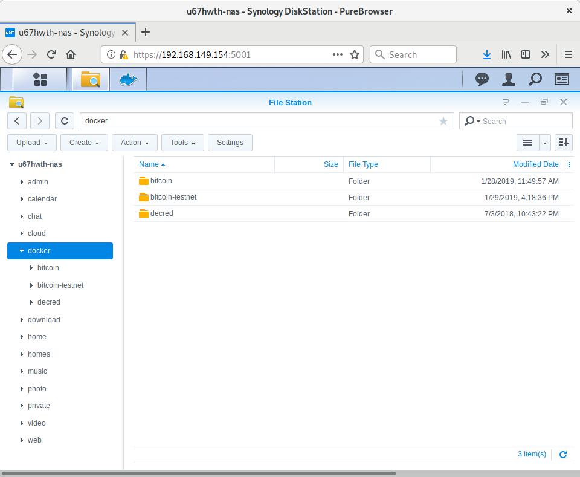
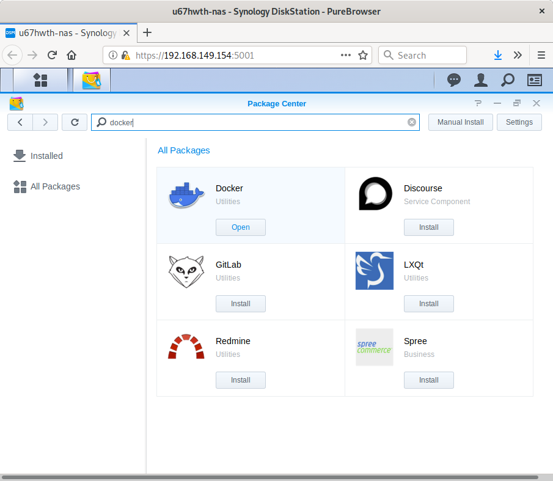
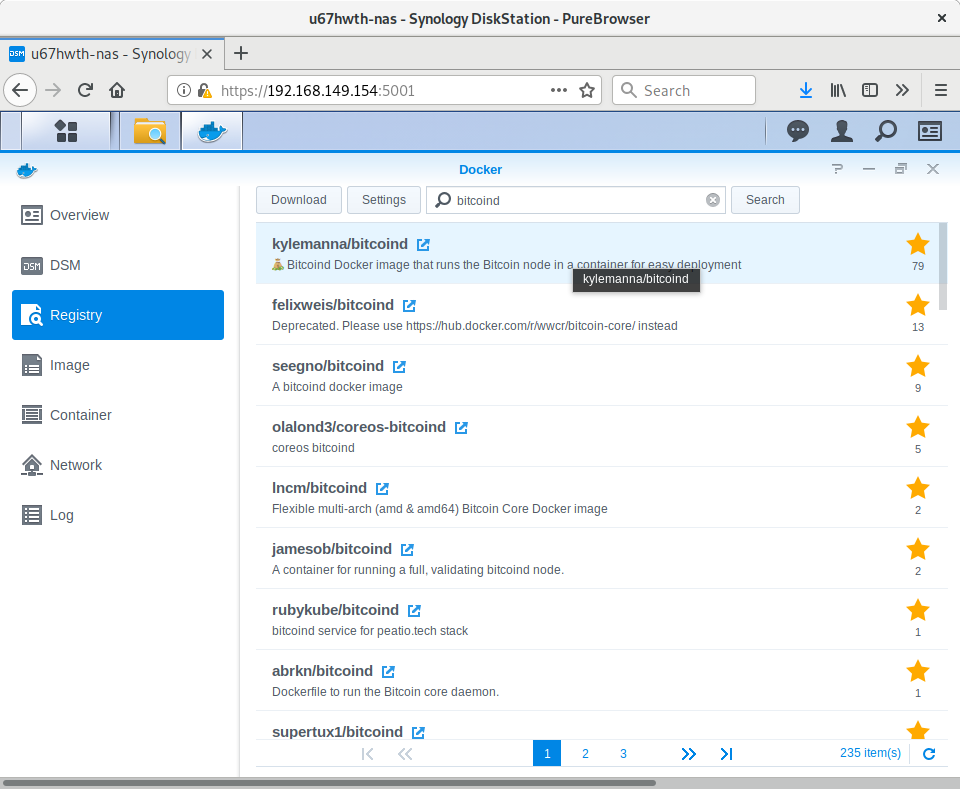
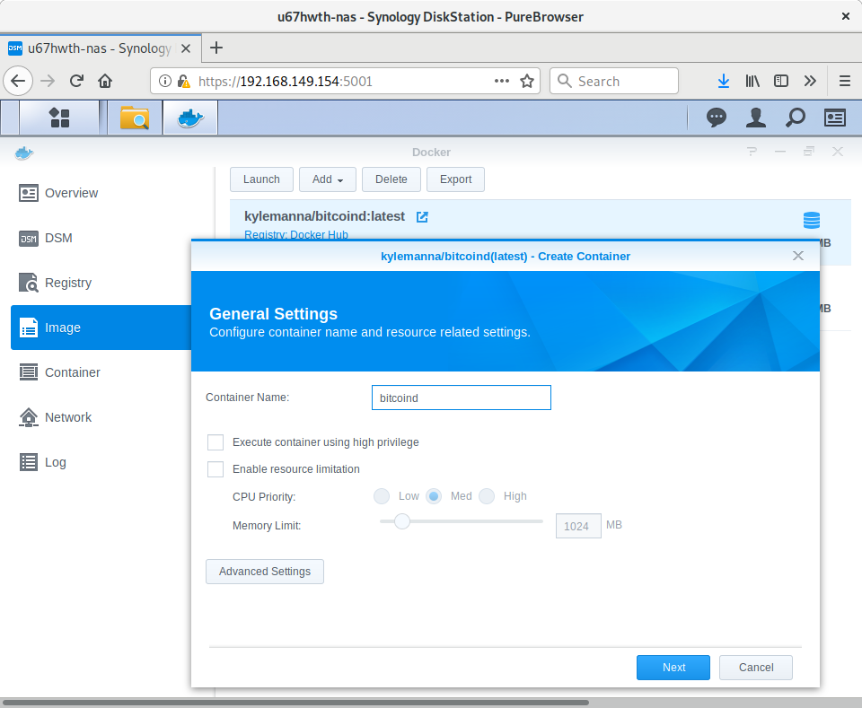
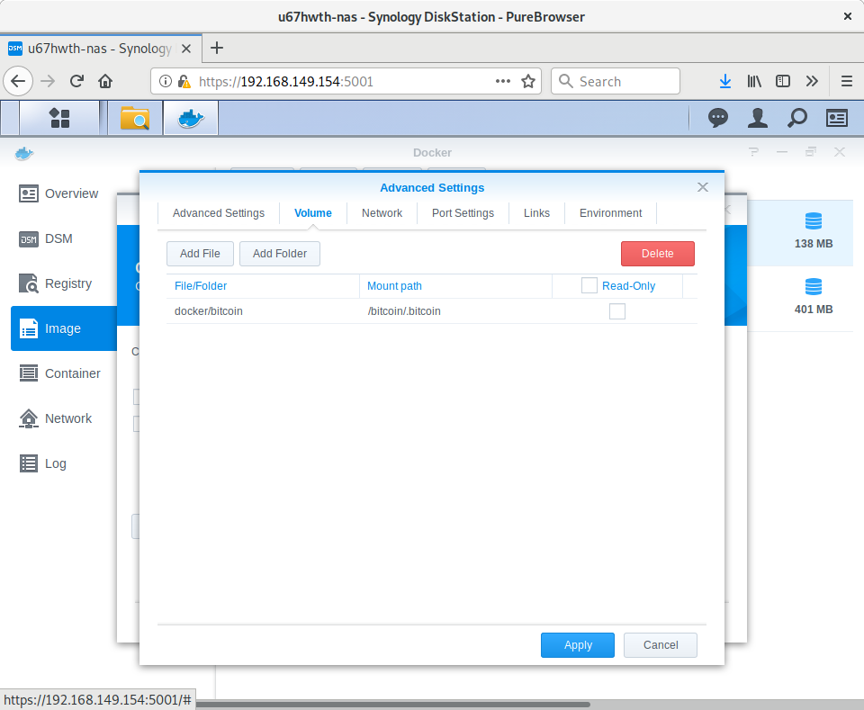
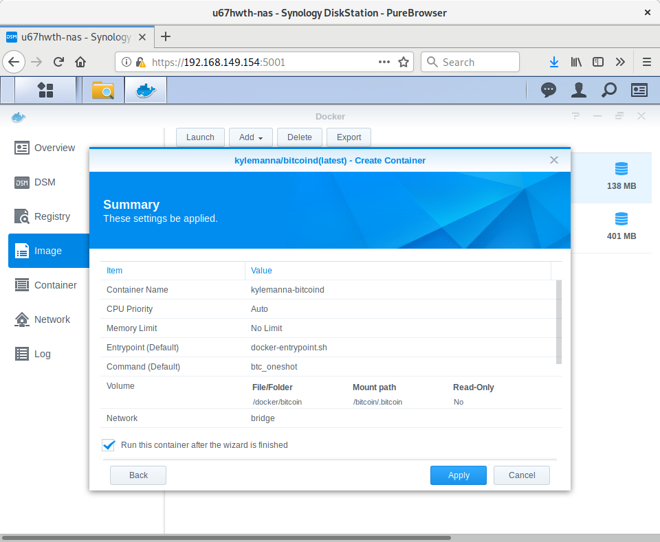

#  Setting up a Bitcoin node on Synology NAS

## Introduction

In this simple tutorial, we will be walking through the steps of setting up a bitcoin node on a Synology Network-attached storage (NAS) device in just a few clicks.

## Background

In a sense, Bitcoin is about claiming back full ownership: your keys, your money. Network-attached storage is also about claiming full ownership over your data. Considering that a typical NAS might likely have spare storage, and typically runs 24/7, they are a perfect candidate on which to run a bitcoin node.

### Why Synology?

Synology Inc. is a Taiwanese corporation that specialises in Network-attached storage appliances, and well I happen to own one :)

## Let's get started

For this tutorial, we will be deploying a bitcoin docker instance using Synology File Station. Synology File Station is the centralised file management tool for your Synology NAS. Through File Station, you can manage and search files/folders, view files of various types, share private files with external users, mount remote folders and virtual drives for access, and do much more!

To continue, you will need to access your NAS via File Station. The default HTTPS port number is 5001, so you can securely access DSM by entering the following address: https://server-hostname:5001/.

Once we have successfully accessed the File Station interface, we can continue by creating a folder where Docker will store our bitcoin node data. To do this access File Station, then create a "docker" folder in the root of your NAS. We can create as many folders for each separate node we might want to run, e.g. "bitcoin-mainnet", "bitcoin-testnet", etc..

For the purpose of this tutorial, we will be creating a bitcoin node configured in testnet mode.



You will need to create a `bitcoin.conf` file in the root of each instance you wish to run. In our example, we will be adding a few lines as follows to the `<NASRoot>/docker/bitcoin-testnet/bitcoin.conf` file:

```console
testnet=1                 # optional
rest=1                    # optional, REST API server
txindex=1                 # optional, transaction indexing
disablewallet=1           # for security reasons
printtoconsole=1          # to see logs in Docker interface
rpcuser=yourusername
rpcpassword=yourpassword
```

Next, we will need to install docker by accessing the `Package Center` from our NAS administration page. From here search for the `docker package`, then select the and install option.



 We are now ready to install our bitcoin docker instance by visiting opening the `Docker` package, then selecting "Registry" and searching for "bitcoind". I recommend downloading the `kylemanna` image which will simply install bitcoind on an Ubuntu instance and from its official repository - feel free to inspect the code at [Github](https://github.com/kylemanna/docker-bitcoind/blob/master/Dockerfile)



Next, go to `Images` within Docker and select the `Launch` option of the image you just downloaded. A `Create Container` dialog is shown. You can adjust the name to something which suits your needs. We can leave the other options at default unless you have any specific preferences here. Next, select the `Advanced Settings` option.



To restart your container after an OS update or restart, select the `Enable auto-restart`.
From the  `Volume`, select `Add Folder`, enter your local path in `File/Folder` and `/bitcoin/.bitcoin` as `Mount path`.



Next, select the `Network` table, and check the `Use the same network as Docker host` option if you want to accept external connections. Not selecting this option may cause your node to ban all incoming connections due to a single misbehaving node, as all nodes would be seen coming from a single IP over the Docker network bridge.

Finally, select `Apply` to verify your settings, followed by `Next`, and `Apply` to launch your container.



Don't forget to open ports required for the Remote Procedure Call (RPC, default is port 18444) and Peer-to-Peer (P2P) interfaces for external access if required. The following defaults are used based on the network you've configured in your `bitcoin.conf` file.

```console
Mainnet - 8332 (P2P), 8333 (RPC)
Testnet - 18332 (P2P), 18333 (RPC)
Regtest - 18443 (P2P), 18444 (RPC)
```
The can be overridden using the `port` and `rpcport` configuration options.

To upgrade your instance, repeat the process starting at image download when needed.

## Conclusion

It may take up to a couple of hours to download the whole blockchain and index transactions for the first time, but we have a full node running on mainnet, testnet or both in a few minutes. You can now go to sleep while contributing to the bitcoin network or play around with your node, querying for transactions, crawling the network and more.

Have fun.
