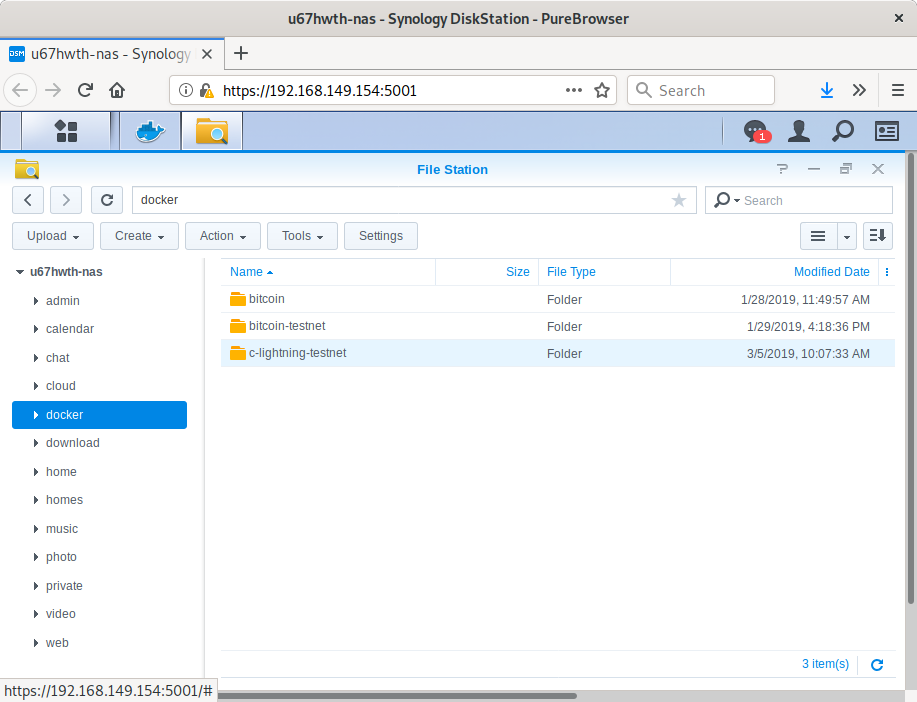
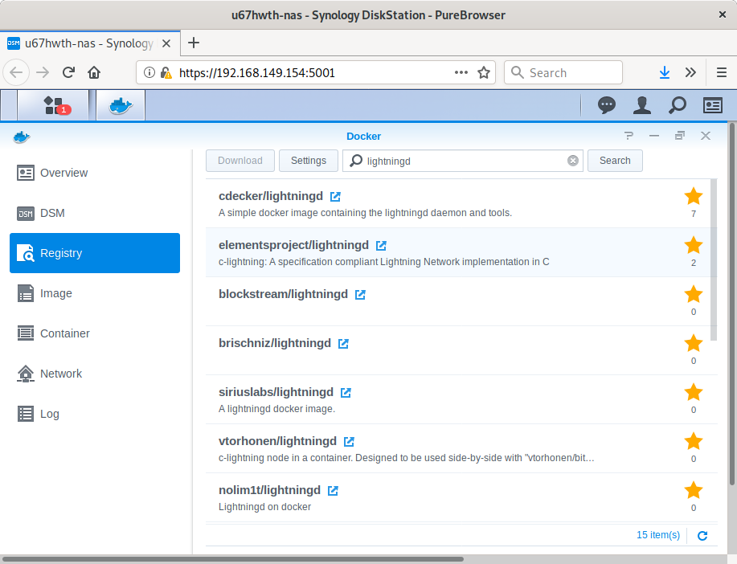
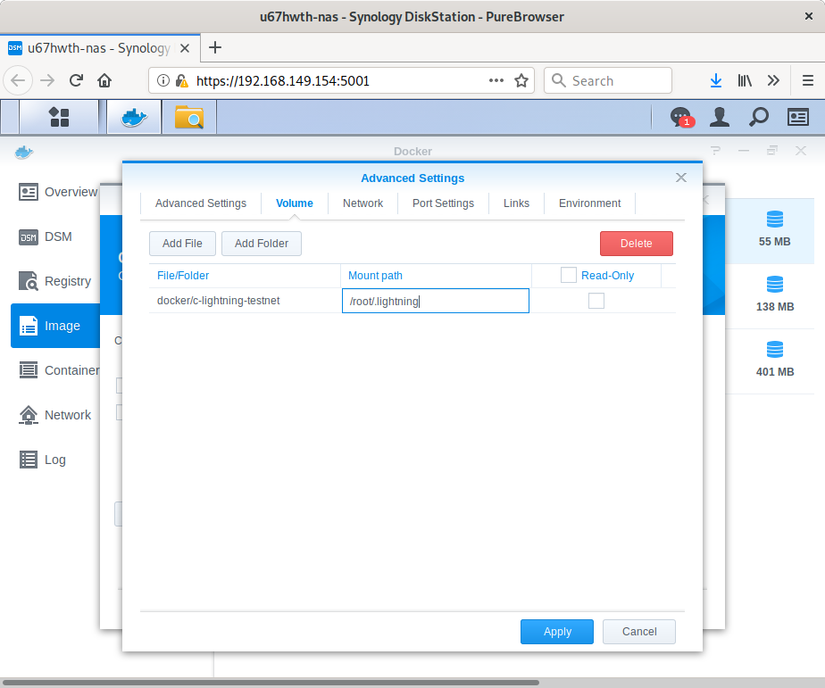
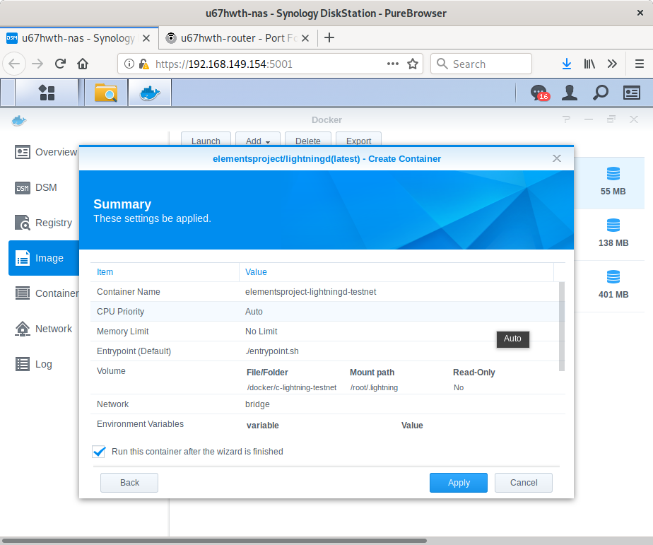
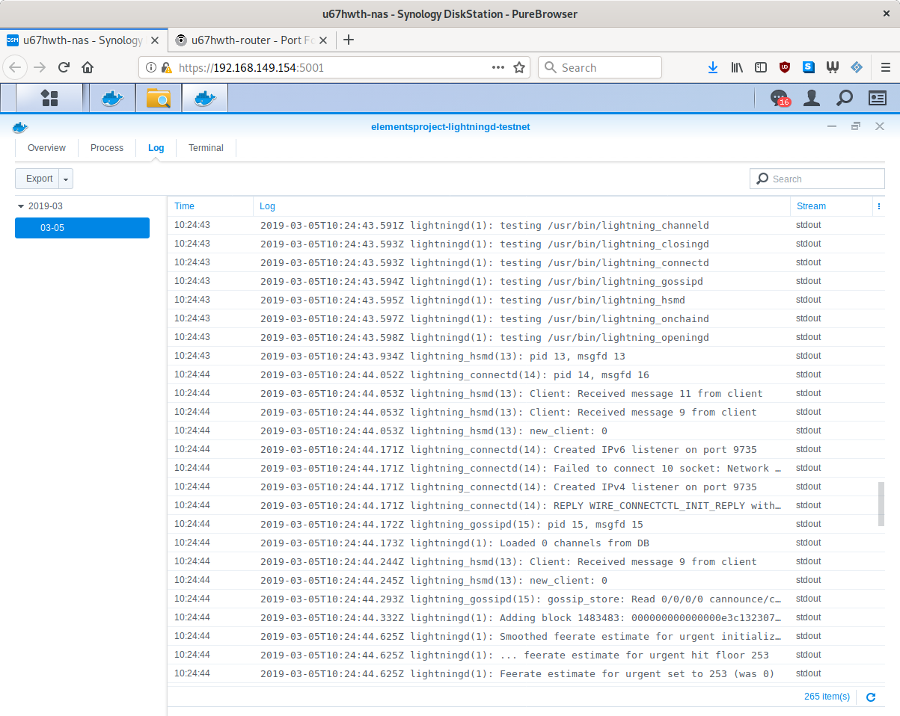

# A Lightning Node on NAS

## Introduction

In this tutorial, we will be setting up a lightning node docker container on a Synology Network-attached storage (NAS) device.

## Background

Building on previous [tutorial](https://bitcoindev.network/running-a-bitcoin-node-on-synology-nas/) that guides through running a full bitcoin node on NAS, we will utilize the same method to fire up a lightning node.

## Let's get started

For this tutorial, we will be deploying a c-lightning docker instance on testnet using Synology Disk Station Manager (DSM) and interact with it through SSH.

### Prepare the environment

We first have to create a folder where lightning node data will be stored. Just open `File Station` and create the following folder `/docker/c-lightning-testnet` or any other name that suits your needs.



We then need to create a configuration file for `lightningd`. Open a new file with your favorite text editor, add the following line and save it as `config` - no extension - under the previously created folder.

```console
alias=your_alias
network=testnet
bitcoin-rpcuser=your_rpcuser
bitcoin-rpcpassword=your_rpcpassword
bitcoin-rpcconnect=127.0.0.1
bitcoin-rpcport=18332
log-level=io
```

### Install and run c-lightning

To install c-lighning we will use Docker and download the image published by Blockstream. Launch Docker through DSM, go to the `Registry` tab, search for `lightningd` and download the image from [elementsprojects](https://elementsproject.org/).



Once downloaded, we have to setup the container before starting it. Go to the `Image` tab, select the `lightningd` image and click `Launch`. Name the container at your will and click `Advanced Settings`.
On the first tab, you may want to enable auto-restart to have your lighningnode booting up with your NAS. From the `Volume` tab, select `Add Folder`, enter your local path in `File/Folder` and `/root/.lightning` as `Mount path`.



We select then the `Network` tab and check the `Use the same network as Docker host` option, this will make our life easier.
Finally, click `Apply`, followed by `Next`, and `Apply` to launch our container.



#### Sanity check

To check if all goes well, we will check `lightningd` logs. To do so, go to the `Container` tab, select the corresponding container and click `Details`. Select then the `Log` tab and see :)



### Interact with lightningd

#### Connect to container's shell

While there is a Terminal tab in Docker GUI of DSM, it does not allow to paste text from the clipboard which makes it highly unconvinient. We will therefore connect to c-lightning container shell through terminal.
To begin with we have to access our NAS terminal using `ssh` as follows. Please refer to these [instructions](https://www.synology.com/en-global/knowledgebase/DSM/help/DSM/AdminCenter/system_terminal) to enable SSH access if not already done.

```shell
simon@librem13:~$ ssh simon@192.168.149.154
simon@192.168.149.154's password:
```

Once connected to the NAS, we have can identify lightningd container id with the following command.

```shell
simon@192.168.149.154:~$ sudo docker ps
Password:
CONTAINER ID        IMAGE                               COMMAND                  CREATED             STATUS              PORTS               NAMES
4766891d9956        elementsproject/lightningd:latest   "./entrypoint.sh"        7 hours ago         Up 4 hours                              elementsproject-lightningd-testnet
7ccba72be25c        kylemanna/bitcoind:latest           "docker-entrypoint..."   5 weeks ago         Up 4 hours                              kylemanna-bitcoin-testnet
3afb6423b342        kylemanna/bitcoind:latest           "docker-entrypoint..."   5 weeks ago         Up 7 days                               kylemanna-bitcoin
```

And finally connect to our container's shell as follows.

```shell
simon@u67hwth-nas:~$ sudo docker exec -it 4766891d9956 bash
```

#### Fund lightning node

We are now ready to interact with the lighning network but first things first, we have to fund our node. We will begin by retreiving a payment address.

```shell
bash-4.4# lightning-cli newaddr
{
  "address": "tb1q2yt78az36rjfdek8g5jy969v2yq92tkc6282mx"
}
```

We can now send some testnet bitcoin to our lightning node, if you don't have any you can use [Yet Another Bitcoin Testnet Faucet](https://testnet-faucet.mempool.co/) which works as a charm. Note that we will have to wait for three blocks before the status changes to `confirmed` which we can check using `listfunds` command.

```shell
bash-4.4# lightning-cli listfunds
{
  "outputs": [
    {
      "txid": "f338a4cdd5de86a377b041410d9607090bc3d692408df628777bebf1b7df7697",
      "output": 0,
      "value": 1000000,
      "amount_msat": "1000000000msat",
      "address": "tb1q2yt78az36rjfdek8g5jy969v2yq92tkc6282mx",
      "status": "confirmed"
    }
  ],
  "channels": [
  ]
}
```

#### Open a channel

From the previous command we can also notice that our channel list is empty, we will now open a channel with a random node to get started with. We can select one from [1ML](https://1ml.com/testnet/node?order=nodeconnectednodecount&public=true) and connect.

```shell
bash-4.4# lightning-cli connect 0269a94e8b32c005e4336bfb743c08a6e9beb13d940d57c479d95c8e687ccbdb9f 197.155.6.38 9735
{
  "id": "0269a94e8b32c005e4336bfb743c08a6e9beb13d940d57c479d95c8e687ccbdb9f"
}
```

Once connected, we can fund the channel as follows.

```shell
bash-4.4# lightning-cli fundchannel 0269a94e8b32c005e4336bfb743c08a6e9beb13d940d57c479d95c8e687ccbdb9f 20000
{
  "tx": "020000000001019776dfb7f1eb7b7728f68d4092d6c30b0907960d4141b077a386ded5cda438f30000000000ffffffff02204e0000000000002200200966df0e4d94b695688096bb752df2198eb68138f7753e0ccc4ec94e48a8e59686f30e00000000001600147466bc01544cef0960da1169ecdf4226826fc8eb0248304502210085f72af738bcf18a14a476375de56be99e930e18921c03228580ee78672b919e022071ffde485d43e8dd2d0dbf289fc29f3afe255259fcd99431bf806bd9c12819a7012103a77069a28dc036baea39cc9c861aba258ac83251b56edd601ef7b4fafa04560300000000",
  "txid": "c8fad66f6596941e3d39eb7044d5218c6328ace08d4f20afad96df9f85ee3cae",
  "channel_id": "ae3cee859fdf96adaf204f8de0ac28638c21d54470eb393d1e9496656fd6fac8"
}
```

Note that we won't be able to fund another channel before the previous is confirmed whch we can check using the `listfunds` command.


```shell
bash-4.4# lightning-cli listfunds
{
  "outputs": [
    {
      "txid": "c8fad66f6596941e3d39eb7044d5218c6328ace08d4f20afad96df9f85ee3cae",
      "output": 1,
      "value": 979846,
      "amount_msat": "979846000msat",
      "address": "tb1qw3ntcq25fnhsjcx6z957eh6zy6pxlj8tpl0dhg",
      "status": "confirmed"
    }
  ],
  "channels": [
    {
      "peer_id": "0269a94e8b32c005e4336bfb743c08a6e9beb13d940d57c479d95c8e687ccbdb9f",
      "short_channel_id": "1483554x95x0",
      "channel_sat": 20000,
      "our_amount_msat": "20000000msat",
      "channel_total_sat": 20000,
      "amount_msat": "20000000msat",
      "funding_txid": "c8fad66f6596941e3d39eb7044d5218c6328ace08d4f20afad96df9f85ee3cae"
    }
  ]
}
```

#### Get some inbound capacity

To complete our lighning node operating capabilities, we should get some inbound capacity, i.e. a node that opens a channel with ours but that's another story!

## Conclusion

We have a lightning node running on testnet in just a few clicks and commands. Please bear in mind the following from c-lightning README but do not hesitate playing around with it on the testing network.

>  This implementation is still very much a work in progress. It can be used for testing, but **it should not be used for real funds**.

Let's build :)

## Reference

c-lightining at [GitHub](https://github.com/ElementsProject/lightning)
