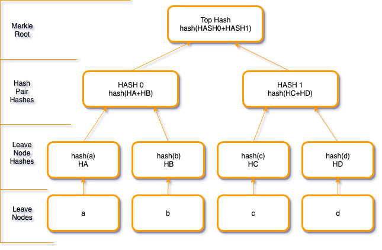

# Calculating the Merkle Root for a block

## Overview

This tutorial is written to simplify the understanding of how bitcoin uses merkle trees for verification of transaction into a block. A merkle root is created by hashing together pairs of TXIDs, which gives you a short yet unique fingerprint for all the transactions in a block.

This merkle root is then used as a field in a block header, which means that every block header will have a short representation of every transaction inside the block.

This tutorial will demonstrate how you calculate the merkle root field.

## Prerequisite

You will need access to a bitcoin node. We suggest executing against a node configured in `regtest` mode so that we can have the freedom of playing with various scenarios without having to loose real money. You can however execute these against either the `testnet` or `mainnet` configurations.

> **Note:**
> If you don't currently have access to a bitcoin development environment set up, dont' worry, we have your back! We've setup a web based mechanism which provisions your very own private session that includes these tools and comes preconfigured with a bitcoin node in `regtest` mode. https://bitcoindev.network/bitcoin-cli-sandbox/
> Alternatively, we have also provided a simple docker container configured in `regtest` mode that you can install for testing purposes.
> ```console
> gr0kchain:~ $ docker volume create --name=bitcoind-data
> gr0kchain:~ $ docker run -v bitcoind-data:/bitcoin --name=bitcoind-node -d \
>      -p 18444:18444 \
>      -p 127.0.0.1:18332:18332 \
>      bitcoindevelopernetwork/bitcoind-regtest
> ```

You can also check for available nodes by following the details of our [Bitcoin network statistics](https://bitcoindev.network/bitcoin-network-statistics/) tutorial.

## Understanding hashes

Before diving into merkle trees, let's look into a primitive required for their operation called hash functions, or trapdoor functions. These functions are easy to compute in one direction, yet difficult to compute in the opposite direction (finding its inverse) without special information, called the "trapdoor". Trapdoor functions are widely used in cryptography. A hash function is any function that can be used to map digital data of an arbitrary size to a fixed size with slight differences in input data producing very big differences in output data.

Some of these hash functions include [md5](https://en.wikipedia.org/wiki/MD5), [sha1](https://en.wikipedia.org/wiki/SHA-1) and [sha256](https://en.wikipedia.org/wiki/SHA-2).

### Example of using sha256

To keep things simple, let's demonstrate using openssl's sha256 feature.

```console
gr0kchain@bitcoindev $ echo -en "Hello World" | openssl dgst -sha256
a591a6d40bf420404a011733cfb7b190d62c65bf0bcda32b57b277d9ad9f146e
```

Here we are providing the into `Hello World` and piping it the the `opnessl` command with the digest flag of `sha256`. The output we receive here is the finger print of the input data `a591a6d40bf420404a011733cfb7b190d62c65bf0bcda32b57b277d9ad9f146e`. Anyone using `sha256` on the same input data would result in the same hash. A slight change to the data results in a completely different hash.


```console
gr0kchain@bitcoindev $ echo -en "Hello World." | openssl dgst -sha256
f4bb1975bf1f81f76ce824f7536c1e101a8060a632a52289d530a6f600d52c92
```


## Some background on merkle trees

In the previous example we had a brief look into how you can generate a unique finger print from any arbitrary input data. This comes in useful when we need to provide a cryptographic proof for a large amount of data. This data can be presented in what is called a merkle or hash tree. Merkle trees are a data structure from which you can derive the same hash as we had indicated before.



A property of merkle trees is that any change in the leave node layer would result in a completely different merkle root hash. We can therefore use this data structure to verify the integrity of a set of data.

## Calculating a merkle root from the command line

Let's go through the steps required to generate a merkle root.

1. Generate a new address.
  ```shell
  gr0kchain@bitcoindev $ bitcoin-cli getnewaddress
  mgKkU7NQsDrMZ6uY1J7on9TyKKeH3FNnhH
  ```

2. Send bitcoin to the new address.
  ```shell
  gr0kchain@bitcoindev $ bitcoin-cli sendtoaddress mgKkU7NQsDrMZ6uY1J7on9TyKKeH3FNnhH 1
  a99011a19e9894753d6c65c8fa412838ea8042886537588e7205734d5de8956d
  ```

3. Generate a new block.
  ```shell
  gr0kchain@bitcoindev $ bitcoin-cli generate 1
  [
    "1e871187ba510207d88f1bb0aa1895fb2420066277fdbba7c857b339810dfcec"
  ]
  ```
4. Get the information for the block.
  ```shell
  gr0kchain@bitcoindev $ bitcoin-cli getblock 1e871187ba510207d88f1bb0aa1895fb2420066277fdbba7c857b339810dfcec
  {
    "hash": "1e871187ba510207d88f1bb0aa1895fb2420066277fdbba7c857b339810dfcec",
    "confirmations": 1,
    "size": 553,
    "height": 132,
    "version": 536870912,
    "merkleroot": "25c8487847de572c21bff029a95d9a9fecd9f4c2736984b979d37258cd47bd1f",
    "tx": [
      "3bd3a1309a518c381248fdc26c3a6bd62c35db7705069f59206684308cc237b3",
      "a99011a19e9894753d6c65c8fa412838ea8042886537588e7205734d5de8956d"
    ],
    "time": 1553088284,
    "mediantime": 1553087229,
    "nonce": 3,
    "bits": "207fffff",
    "difficulty": 4.656542373906925e-10,
    "chainwork": "000000000000000000000000000000000000000000000000000000000000010a",
    "previousblockhash": "78c3c76fe213ca9f5a0f616b155341eb12b963ce10107b18c9ff612cfc90843d"
  }
  ```
  Here we can see the two transaction identifiers for the block as `3bd3a1309a518c381248fdc26c3a6bd62c35db7705069f59206684308cc237b3` (our coinbase) and `a99011a19e9894753d6c65c8fa412838ea8042886537588e7205734d5de8956d` (the identifier for the transaction we executed above)

5. Next, we need to reverse the order of these from big to little endian (network byte order)

  ```shell
  gr0kchain@bitcoindev $ (export LC_ALL=C; xxd -revert -plain <<< 3bd3a1309a518c381248fdc26c3a6bd62c35db7705069f59206684308cc237b3 | rev | tr -d '\n' | xxd -plain | tr -d '\n')
  b337c28c30846620599f060577db352cd66b3a6cc2fd4812388c519a30a1d33b
  gr0kchain@bitcoindev $ (export LC_ALL=C; xxd -revert -plain <<< a99011a19e9894753d6c65c8fa412838ea8042886537588e7205734d5de8956d | rev | tr -d '\n' | xxd -plain | tr -d '\n')
  6d95e85d4d7305728e583765884280ea382841fac8656c3d7594989ea11190a9
  ```
  > **Note**
  > LC_ALL=C is used here to remove all localised settings.

6. Concatenate these values and calculate a sha256 digest from the binary data

  ```shell
  gr0kchain@bitcoindev $ echo -en "b337c28c30846620599f060577db352cd66b3a6cc2fd4812388c519a30a1d33b6d95e85d4d7305728e583765884280ea382841fac8656c3d7594989ea11190a9" | xxd -r -p | sha256
  c1f8c1f3b52135cf7f9d0f9422d6d826f4097631615fcc44e3ec70461c27b7b2
  ```

7. Convert this value to binary and perform another sha256 operation on the output
  ```shell
  gr0kchain@bitcoindev $ echo -en "c1f8c1f3b52135cf7f9d0f9422d6d826f4097631615fcc44e3ec70461c27b7b2" | xxd -r -p | sha256
  1fbd47cd5872d379b9846973c2f4d9ec9f9a5da929f0bf212c57de477848c825
  ```
8. Finally, reverse the order from little to big endian.

  ```shell
  gr0kchain@bitcoindev $ (export LC_ALL=C; xxd -revert -plain <<< 1fbd47cd5872d379b9846973c2f4d9ec9f9a5da929f0bf212c57de477848c825 | rev | tr -d '\n' | xxd -plain | tr -d '\n')
  25c8487847de572c21bff029a95d9a9fecd9f4c2736984b979d37258cd47bd1f
  ```

Good job! We now have the original `merkleroot` value from our `bitcoin-cli getblock` command! You can repeat the process for as many transaction as you like.

## Exception for merkle roots of block containing only the coinbase transaction

The only exception to the process above is when generating the merkle root for a block which contains a single transaction.

```shell
gr0kchain@bitcoindev $ bitcoin-cli generate 1
[
  "78c3c76fe213ca9f5a0f616b155341eb12b963ce10107b18c9ff612cfc90843d"
]
gr0kchain@bitcoindev $ bitcoin-cli getblock 78c3c76fe213ca9f5a0f616b155341eb12b963ce10107b18c9ff612cfc90843d
{
  "hash": "78c3c76fe213ca9f5a0f616b155341eb12b963ce10107b18c9ff612cfc90843d",
  "confirmations": 1,
  "size": 181,
  "height": 131,
  "version": 536870912,
  "merkleroot": "4415425121d3e80d3d733323ecdc981d43b6888241b99c0217a6b7184b021f5e",
  "tx": [
    "4415425121d3e80d3d733323ecdc981d43b6888241b99c0217a6b7184b021f5e"
  ],
  "time": 1553088104,
  "mediantime": 1553087066,
  "nonce": 0,
  "bits": "207fffff",
  "difficulty": 4.656542373906925e-10,
  "chainwork": "0000000000000000000000000000000000000000000000000000000000000108",
  "previousblockhash": "0d0c6c9b2c5b48451832c15cf6e8856772df2a0760f8614dbc0734e1e9d7171a"
}
```

Here we can see that the merkle root is the same as the transaction id for the coinbase transaction.


## Conclusion

In this tutorial we had a look at hash functions, merkle trees and how to calculate the merkle root. We then proceeded to demonstrate how you this can be done using the bitcoin core cli tool with some helper command line utilities.

## Reference

* [Reverse a hexadecimal number in bash](https://unix.stackexchange.com/questions/321860/reverse-a-hexadecimal-number-in-bash/321867)
* [LC_ALL=C Linux meaning](https://www.programering.com/a/MDM3UzNwATQ.html)
